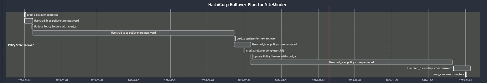

### Purpose

The goal of this process is to ensure **zero downtime** during HashiCorp's rollover of SiteMinder Policy Store and User Store passwords. 

- **Policy Store Password:** This password must be updated on every Policy Server.
- **User Store Password:** This password only needs to be updated on one Policy Server via a REST API connection.

### Ensuring Zero Downtime

#### Policy Store
Updating the Policy Store password requires restarting each Policy Server. To avoid downtime, this process will be done via **rolling updates**:
- Update and restart one server at a time.
- Ensure the updated server is functioning correctly before proceeding to the next server.

#### User Store
Since Policy Servers cache user credentials, we will maintain two sets of working credentials (`cred_a` and `cred_b`) during the password change process:
- During the update, some Policy Servers may still have cached credentials (`cred_b`), while others use the new credentials (`cred_a`). 
- Both credentials will work simultaneously, allowing continued operation until all caches are refreshed.

### Credential Management Strategy

Password rollovers are assumed to occur **every 6 months**. Three sets of credentials are required:

1. **cred_a**: Rollover occurs on January 1st and July 1st.
2. **cred_b**: Rollover occurs on January 31st and July 31st (one-month gap from `cred_a`).
3. **cred_c**: Static credential used by HashiCorp as a master account for rolling over credentials.

### Rollover Plan: Policy Store Connection

1. **Initial Setup**: SiteMinder Policy Servers use `cred_b` for the Policy Store connection.
2. **January 1st, 00:00 SGT**: `cred_a` is rolled over.
3. **January 7th, 00:00 SGT**: Run the HashiCorp integration script to fetch `cred_a` and update it as the Policy Store password. Restart each Policy Server one at a time to ensure zero downtime.
4. **June 23rd, 00:00 SGT** (7 days before `cred_a` rollover): Run the HashiCorp integration script to fetch `cred_b` and update the Policy Store password. Restart each Policy Server one at a time to ensure zero downtime.
5. **July 1st, 00:00 SGT**: `cred_a` is rolled over.
6. **July 7th, 00:00 SGT**: Run the HashiCorp integration script to fetch `cred_a` and update it as the Policy Store password. Restart each Policy Server one at a time to ensure zero downtime.
7. **Ongoing**: Repeat the same process for future rollovers.

### Rollover Plan: User Store Connection

1. **Initial Setup**: SiteMinder uses `cred_b` for the User Store connection.
2. **January 1st, 00:00 SGT**: `cred_a` is rolled over.
3. **January 7th, 00:00 SGT**: Run the HashiCorp integration script to fetch `cred_a` and update it as the User Store password.
4. **June 23rd, 00:00 SGT** (7 days before `cred_a` rollover): Run the HashiCorp integration script to fetch `cred_b` and update the User Store password.
5. **July 1st, 00:00 SGT**: `cred_a` is rolled over.
6. **July 7th, 00:00 SGT**: Run the HashiCorp integration script to fetch `cred_a` and update it as the User Store password.
7. **Ongoing**: Repeat the same process for future rollovers.

### Summary

By using rolling updates for the Policy Store and dual credentials for the User Store, this plan ensures that SiteMinder experiences **zero downtime** during password rollovers. Regular scheduling and careful management of the three credential sets (`cred_a`, `cred_b`, and `cred_c`) will ensure smooth transitions every six months.
